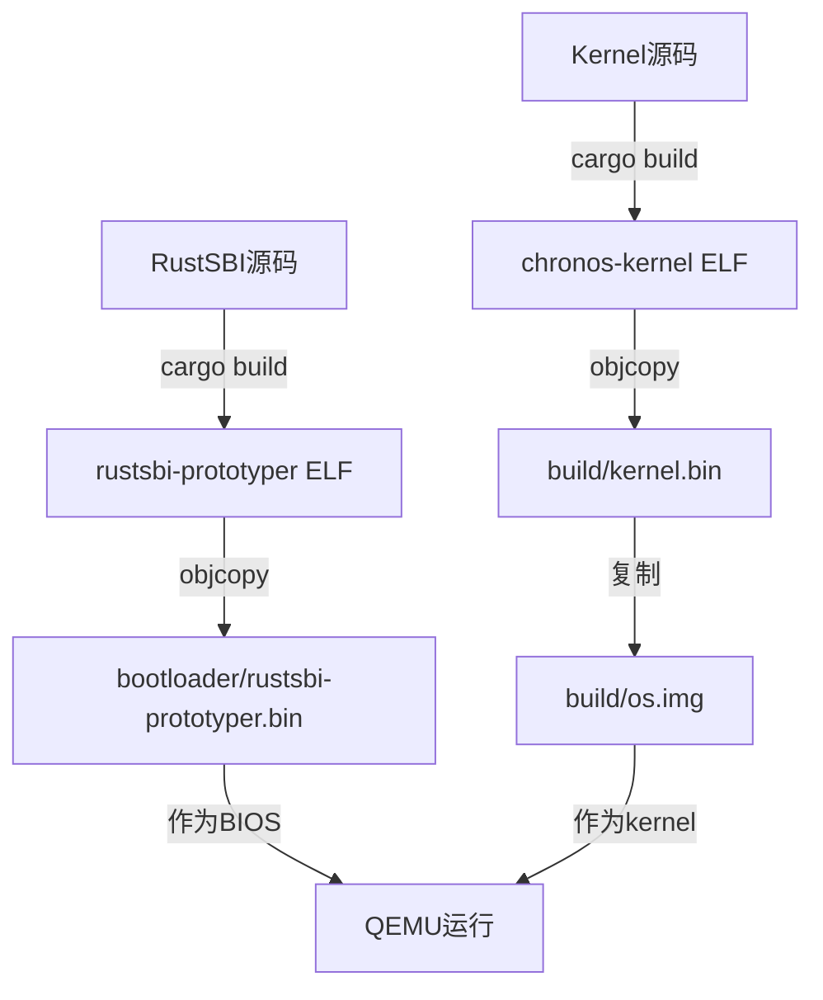

# Bin 文件作用与路径分析

本文档详细分析 Chronos OS 项目中各个二进制文件的作用、构建路径变化和最终用途。

## 文件概览

项目中的 bin 文件分为以下几类：
1. **构建产物**（build/ 目录下的最终文件）
2. **源文件**（各个子目录下的中间产物）
3. **依赖文件**（RustSBI 固件）

---

## 1. RustSBI Prototyper (rustsbi-prototyper.bin)

### 作用
RustSBI（RISC-V Supervisor Binary Interface）是一个符合 SBI 规范的固件，作为操作系统与硬件之间的抽象层。在 QEMU virt 机器上，它充当 BIOS/Firmware 的角色。

### 路径变化

```
源文件构建路径：
rustsbi/target/riscv64gc-unknown-none-elf/release/rustsbi-prototyper (ELF格式)

转换命令：
rust-objcopy --binary-architecture=riscv64 <ELF> --strip-all -O binary rustsbi-prototyper.bin

最终位置：
bootloader/rustsbi-prototyper.bin
```

### 构建流程
1. 从 `rustsbi` 子模块构建 ELF 可执行文件
2. 使用 `rust-objcopy` 转换为纯二进制格式
3. 复制到 `bootloader/` 目录（作为 QEMU 的 -bios 参数文件）

### 最终作用
- 在 QEMU 启动时作为 `-bios` 参数加载（从 `bootloader/rustsbi-prototyper.bin`）
- 提供 SBI 接口服务（如系统关机、控制台输出等）
- 将控制权直接移交给内核（通过加载 os.img 到 0x80200000）

---

## 2. Kernel (kernel.bin)

### 作用
操作系统内核，负责：
- 初始化内存管理
- 初始化异常处理
- 初始化系统调用
- 运行测试代码

### 路径变化

```
源文件构建路径：
kernel/target/riscv64gc-unknown-none-elf/release/chronos-kernel (ELF格式)

转换命令：
rust-objcopy <ELF> --strip-all -O binary kernel.bin

中间位置：
kernel/kernel.bin (可能存在，但非最终产物)

最终位置：
build/kernel.bin
```

### 内存布局
- 入口地址：`0x80200000`（直接由 RustSBI 加载）
- 基址：`BASE_ADDRESS = 0x80200000`

### 代码流程
1. `entry.S`: 设置栈指针，调用 `kernel_main`
2. `main.rs`: 
   - 清理 BSS
   - 初始化控制台
   - 初始化内存管理 (`mm::init`)
   - 初始化陷阱处理 (`trap::init`)
   - 运行测试

### 最终作用
- 直接作为 `os.img` 的全部内容
- 操作系统的主要逻辑
- 通过 SBI 接口与 RustSBI 交互

---

## 3. OS Image (os.img)

### 作用
完整的操作系统镜像文件，包含 bootloader 和 kernel，可直接被 QEMU 加载。

### 构建流程

```
步骤1：直接复制 kernel
cat build/kernel.bin > build/os.img
```

### 内存布局

```
0x80200000 +------------------+
          |   Kernel          |
          |   (variable size) |
          +------------------+
```

### 最终作用
- QEMU 通过 `-kernel` 参数加载
- 由 RustSBI 负责将其加载到内存的 `0x80200000` 位置
- 执行顺序：RustSBI → Kernel（直接跳转，无 bootloader 中间层）

---

## 4. 其他说明

### bootloader/rustsbi-prototyper.bin
- **状态**：RustSBI 的二进制文件
- **说明**：从 `rustsbi/target/.../rustsbi-prototyper` ELF 转换而来
- **用途**：作为 QEMU 的 `-bios` 参数

### kernel/kernel.bin
- **状态**：可能是旧的构建产物或中间文件
- **说明**：不是最终使用的文件，最终版本在 `build/kernel.bin`

---

## 构建顺序总结



## 运行时的执行流程

1. **QEMU 启动**
   - 加载 `bootloader/rustsbi-prototyper.bin` 作为 BIOS
   - RustSBI 初始化硬件

2. **加载 OS 镜像**
   - RustSBI 将 `os.img` 加载到内存 `0x80200000`
   - 直接跳转到内核入口（通过 DynamicInfo）

3. **Kernel 执行**
   - 初始化环境（栈、BSS 等）
   - 初始化各个子系统
   - 运行测试代码
   - 通过 SBI 调用与 RustSBI 交互

---

## 文件大小限制

- **Kernel**: 无硬性限制
  - 大小取决于功能实现
  - 受可用内存限制（QEMU virt 机器默认 128MB RAM）
  - 内核直接从 `0x80200000` 开始，无需为 bootloader 预留空间

---

## 总结

| 文件 | 源路径 | 最终路径 | 作用 | 内存地址 |
|------|--------|----------|------|----------|
| rustsbi-prototyper.bin | rustsbi/target/.../rustsbi-prototyper | bootloader/rustsbi-prototyper.bin | BIOS/Firmware | 固件区域 |
| kernel.bin | kernel/target/.../chronos-kernel | build/kernel.bin | 操作系统内核 | 0x80200000+ |
| os.img | - | build/os.img | 内核镜像 | 0x80200000+ |

**说明**：
- RustSBI BIN 文件存放在 `bootloader/` 目录（作为 QEMU 的 -bios 参数）
- 内核镜像文件存放在 `build/` 目录
- 已移除独立的 bootloader 代码，内核直接从 0x80200000 开始

